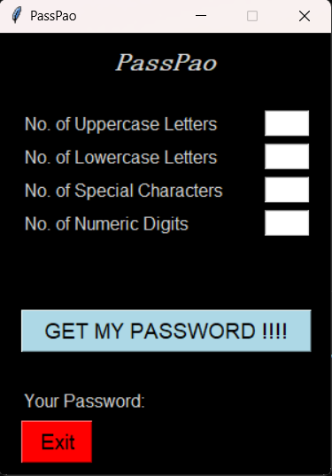
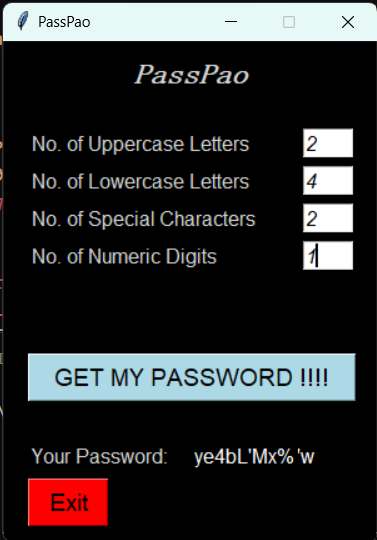

# PassPao: Password Generator

This is a password generating application written in Python. It allows you to generate passwords with a given number of characters, uppercase, lowercase, numeric and special characters.

## Features

- Generate passwords with a given number of characters (from 8 to 16)
- Choose the number of uppercase, lowercase, numeric and special characters in the password
- Customize the password strength (weak, medium, strong)

## How to use

- Clone the repository.
- Open the main.py file in a Python IDE.
- Run the application.
- Enter the desired number of characters, uppercase, lowercase, numeric and special characters in the password.
- Click on the "Get My Password" button.
- The generated password will be displayed.

## Requirements

Python 3.8 or higher
Tkinter module

## Screenshots

## Author

This project was created by Gyandendra Tiwari.
